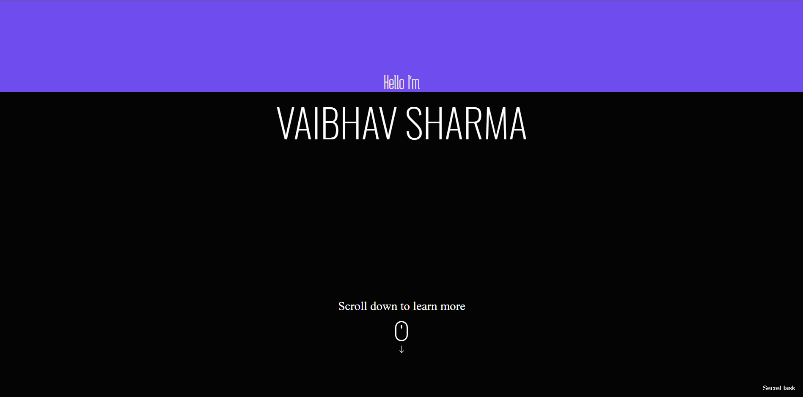

# My Portfolio
This is my basic portfolio website made in vanilla HTML, CSS and JS which is using 100% best practices according to [**Lighthouse**](https://github.com/GoogleChrome/lighthouse).
## Dependencies
* ### [JQuery](https://github.com/jquery/jquery)
* ### [ScrollMagic](https://github.com/janpaepke/ScrollMagic)
* ### [ScrollReveal](https://github.com/jlmakes/scrollreveal)
## Screenshots

## License
Check out the [License](LICENSE)